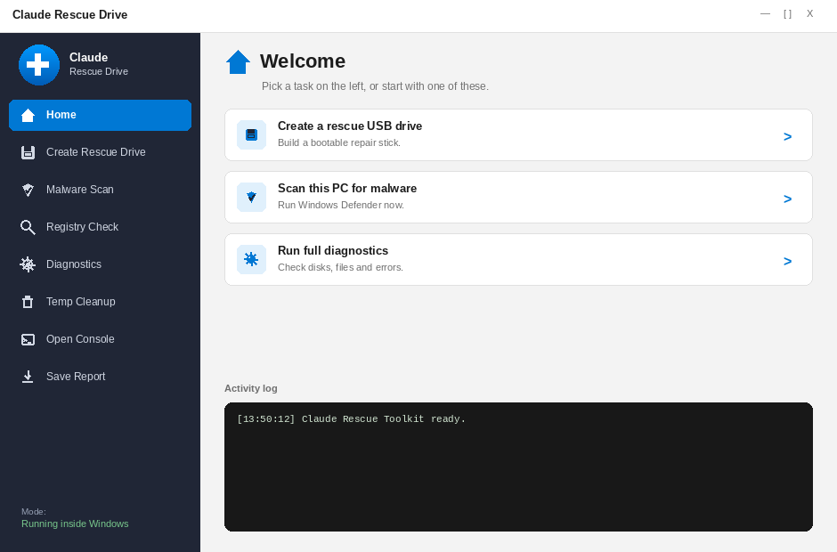
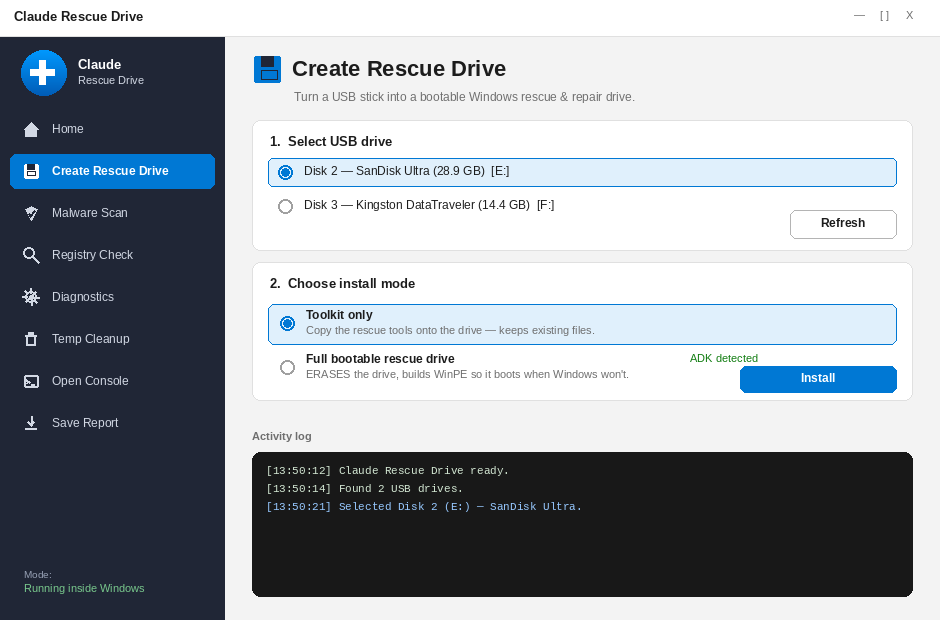
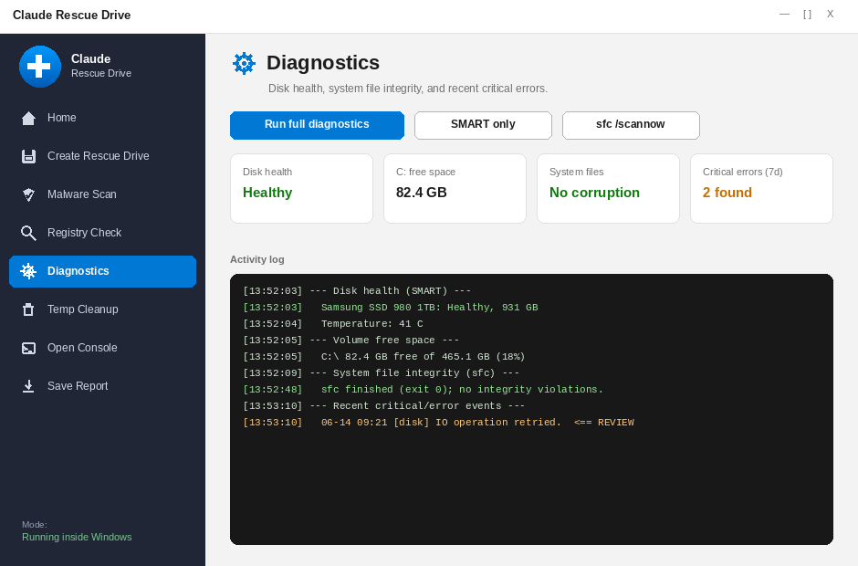
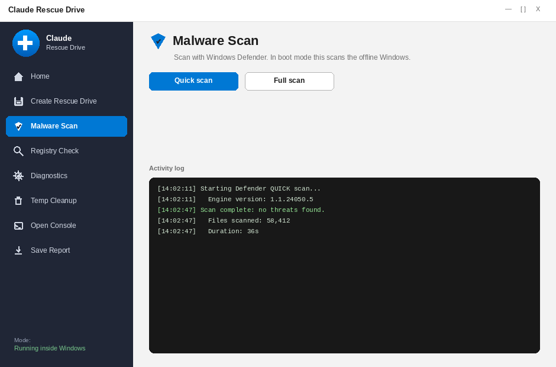
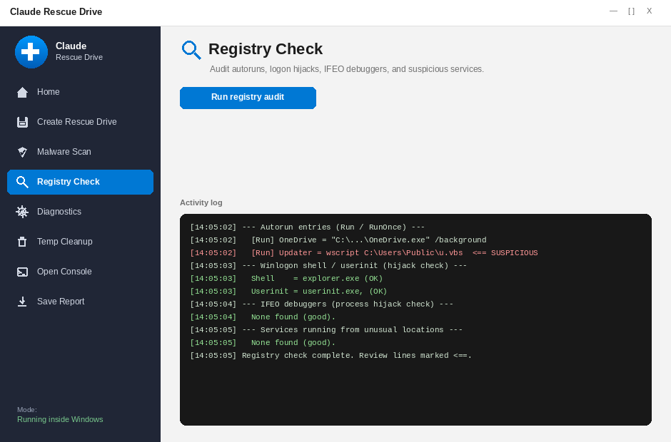
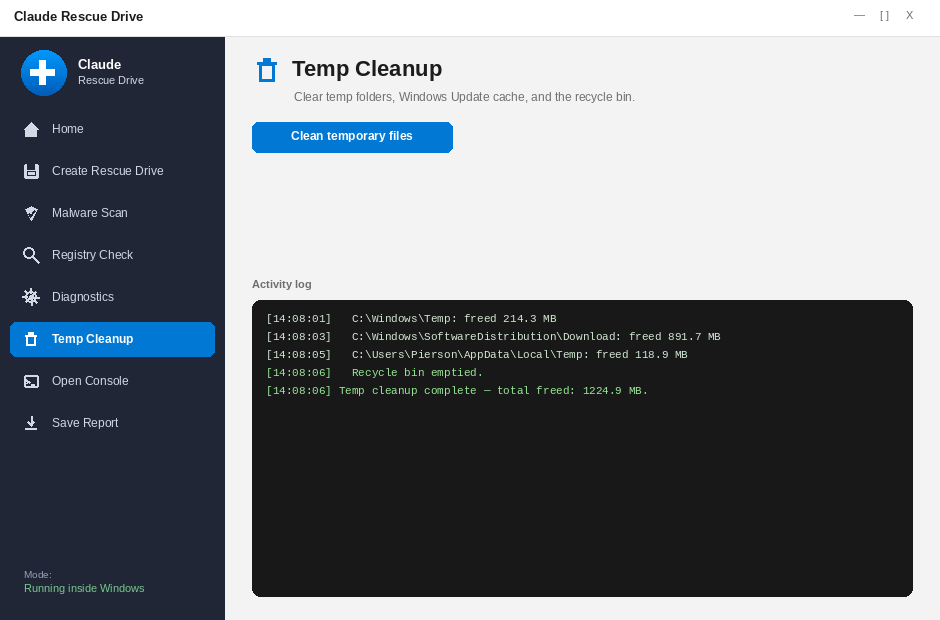
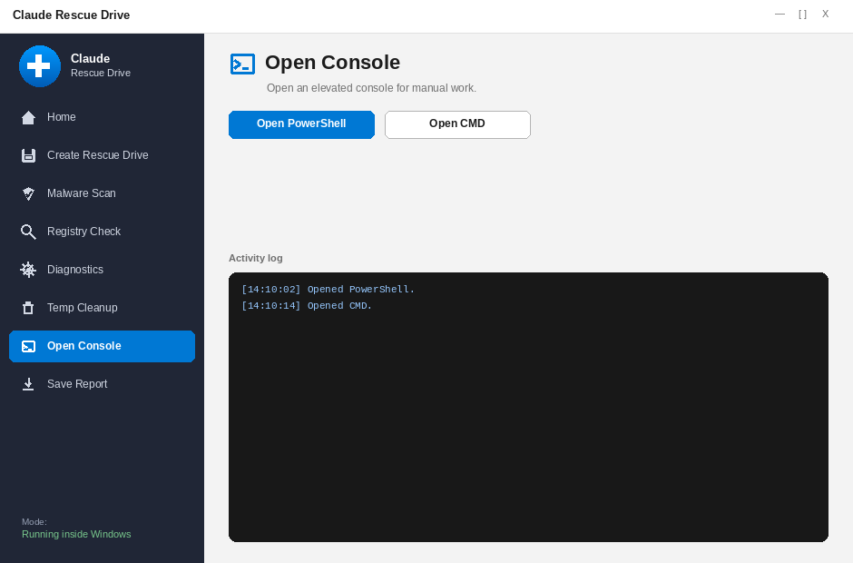
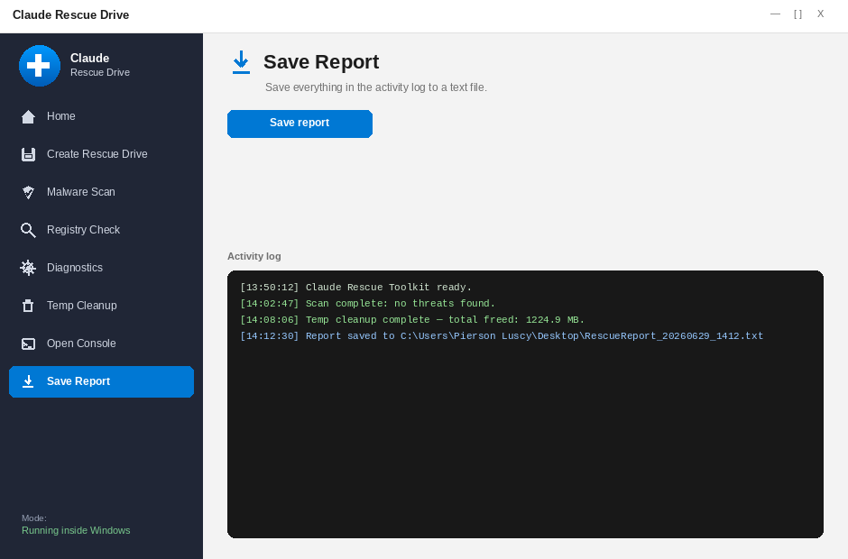

# Claude Rescue Drive

A one-click Windows rescue drive builder with a single-window app that both **builds the
rescue USB** and **runs the repair toolkit** — malware scan, registry audit, diagnostics,
and cleanup — from one place. The drive works two ways:

1. **Inside Windows** — plug it in and run the app (or `RescueToolkit.bat`) from the drive.
2. **Outside Windows (bootable)** — boot the PC from the drive into a WinPE recovery
   environment where the same app launches automatically. Useful when the installed
   OS won't start or is too infected to trust.

## What it looks like

One window, a sidebar (with icons) to switch between creating the drive and each repair
tool, and a shared activity log along the bottom.

**Home** — quick-start cards and the live activity log:



**Create Rescue Drive** — pick a USB, choose toolkit-only or full bootable, click Install:



**Diagnostics** (one of the toolkit tools) — status tiles plus live results in the log:



**Malware Scan**, **Registry Check**, **Temp Cleanup**, **Open Console**, and **Save
Report** follow the same layout — one or two action buttons up top, results in the log:







## What the toolkit does

| Button | What it does |
|---|---|
| **Malware Scan** | Runs Windows Defender (quick/full/custom path). In boot mode it scans the offline Windows installation. |
| **Registry Check** | Audits autorun keys (Run/RunOnce), Winlogon shell/userinit hijacks, Image File Execution Options debuggers, and suspicious services. Loads offline hives when booted from the drive. |
| **Diagnostics** | SMART disk health, `sfc /scannow`, `DISM ScanHealth`, battery report, RAM test scheduling, and recent critical errors from the event log. |
| **Temp Cleanup** | Clears user/system temp folders, Windows Update download cache, and recycle bin; reports space freed. |
| **PowerShell / CMD** | Opens an elevated console for manual work. |

## Quick start

On a Windows 10/11 machine you have two ways to open the app:

- **`Start-RescueDrive.bat`** (recommended) — double-click it. One UAC prompt,
  then the unified window opens. This runs straight from the scripts, so
  SmartScreen and antivirus don't get in the way. (`Install-RescueDrive.bat`
  still works too and opens just the drive-builder.)
- **`dist\RescueDrive.exe`** — a single-file version of the same app. It
  works too, but because it's an unsigned executable that unpacks files and
  launches PowerShell, Windows SmartScreen or Defender may block it the first
  time (see [Troubleshooting](#troubleshooting-the-installer-wont-run) below).

Then, in either case:

1. Pick your USB drive from the list.
2. Choose **Toolkit only** (no formatting, just copies files) or **Full bootable drive**
   (erases the drive, builds WinPE, makes it bootable).
3. Click **Install** and wait.

### Requirements for the bootable option

The bootable build uses Microsoft's official preinstallation environment (WinPE),
which requires two free Microsoft installers on the build machine:

- [Windows ADK](https://learn.microsoft.com/en-us/windows-hardware/get-started/adk-install)
- The **WinPE add-on** for the ADK (same page)

The installer GUI detects whether they're present and tells you if not.
**Toolkit only** mode has no requirements beyond Windows + PowerShell 5.1.

## Repo layout

```
dist/RescueDrive.exe           ONE-CLICK INSTALLER — start here
Install-RescueDrive.bat        Elevating launcher for the installer GUI (repo checkout)
RescueDrive-Installer.ps1      GUI: pick a drive, install/build
Toolkit/
  RescueToolkit.bat            Elevating launcher for the toolkit GUI
  RescueToolkit.ps1            Toolkit GUI (works in Windows and WinPE)
  Extras/                      Drop portable 3rd-party tools here — baked into the boot image
  Modules/
    MalwareScan.ps1
    RegistryCheck.ps1
    Diagnostics.ps1
    TempCleanup.ps1
WinPE/
  Build-BootableImage.ps1      Builds WinPE with the toolkit baked in, writes it to USB
Drivers/                       (optional) .inf drivers to inject into the boot image
installer-exe/                 Source + Build-Exe.ps1 for dist/RescueDrive.exe
```

## What's baked into the WinPE boot image

PowerShell, WMI, .NET, storage cmdlets, DISM cmdlets, BitLocker tooling
(`manage-bde`), wired-network 802.1x support, the deleted-file recovery API
(FMAPI), encrypted-drive hardware support, 512 MB scratch space, everything in
`Toolkit/Extras`, and any `.inf` drivers you place in a `Drivers/` folder.

## Troubleshooting: the installer won't run

If **`dist\RescueDrive.exe`** does nothing, flashes and closes, or shows a blue
"Windows protected your PC" box, it's being blocked — not broken. The exe is
unsigned and it unpacks files and starts PowerShell, which is exactly the
pattern SmartScreen and antivirus treat with suspicion. Pick whichever fix is
easiest:

1. **Use the script launcher instead (simplest).** Double-click
   **`Install-RescueDrive.bat`**. It opens the identical installer without
   tripping SmartScreen.
2. **Unblock the exe.** Right-click `dist\RescueDrive.exe` → **Properties** →
   tick **Unblock** at the bottom → **OK**. Or in PowerShell:
   `Unblock-File .\dist\RescueDrive.exe`. This removes the "downloaded from the
   internet" mark that triggers SmartScreen.
3. **Run it past SmartScreen.** If you still get "Windows protected your PC",
   click **More info → Run anyway**.
4. **Antivirus quarantined it.** If the file vanishes after download, your AV
   removed it as a false positive. Restore it from quarantine and add an
   exclusion, or just use `Install-RescueDrive.bat` (option 1).
5. **"Smart App Control blocked an app that might be unsafe" (Windows 11).**
   Smart App Control is stricter than SmartScreen and has **no "Run anyway"
   option**. It always blocks the unsigned exe, and it also forces PowerShell
   into *Constrained Language Mode* for unsigned scripts — which prevents the
   GUI from opening at all (the scripts now detect this and print an
   explanation instead of failing silently). Unblocking the files does **not**
   lift this restriction. On a machine with Smart App Control enabled you have
   exactly two options:
   - **Turn Smart App Control off**: Windows Security → App & browser control →
     Smart App Control settings → Off. ⚠️ One-way switch — it cannot be
     re-enabled without reinstalling Windows. Defender and SmartScreen remain
     active afterward.
   - **Code-sign the exe and scripts** with a certificate from a trusted CA
     (see the signing section below).

All of these open the same installer GUI — there's no functional difference,
only how Windows treats the file.

## Permanently fixing the warning: sign the exe

The blocks above happen because `RescueDrive.exe` is unsigned. A code signature
removes them for everyone, not just on your own PC. The build is already wired
for it — you only need to supply a certificate:

1. Get an **Authenticode code-signing certificate** as a `.pfx` file. Options:
   buy one from a CA (DigiCert, Sectigo, SSL.com, etc.; OV is cheapest, EV gives
   instant SmartScreen reputation), or, for your own machines only, create a
   self-signed one and trust it locally.
2. **For CI builds (recommended):** base64-encode the pfx and add two GitHub
   repository secrets — `RESCUE_SIGN_PFX_BASE64` and `RESCUE_SIGN_PFX_PASSWORD`.
   ```powershell
   [Convert]::ToBase64String([IO.File]::ReadAllBytes('mycert.pfx')) | Set-Content cert.txt
   ```
   Paste the contents of `cert.txt` into the `RESCUE_SIGN_PFX_BASE64` secret. The
   next push signs `dist\RescueDrive.exe` automatically.
3. **For a local build:** set env vars and run the build:
   ```powershell
   $env:RESCUE_SIGN_PFX_PATH = 'C:\path\to\mycert.pfx'
   $env:RESCUE_SIGN_PFX_PASSWORD = '<password>'
   .\installer-exe\Build-Exe.ps1
   ```

Without a certificate the build still succeeds and produces a working unsigned
exe — signing is skipped, not required. Certificate files are git-ignored so
they can't be committed by accident. Details in `installer-exe\Sign-Exe.ps1`.

## Notes & limitations

- Booting from USB requires enabling it in the PC's firmware (BIOS/UEFI) boot menu,
  usually F12/F2/Esc/Del at power-on. Secure Boot is fine — WinPE is Microsoft-signed.
- In boot (WinPE) mode, Defender real-time engine isn't available; the toolkit uses the
  offline Windows installation's Defender platform when present, and always supports
  registry/diagnostic/cleanup operations against the offline OS.
- BitLocker-encrypted drives must be unlocked first (`manage-bde -unlock C: -RecoveryPassword <key>`),
  the toolkit's console buttons make that easy.
